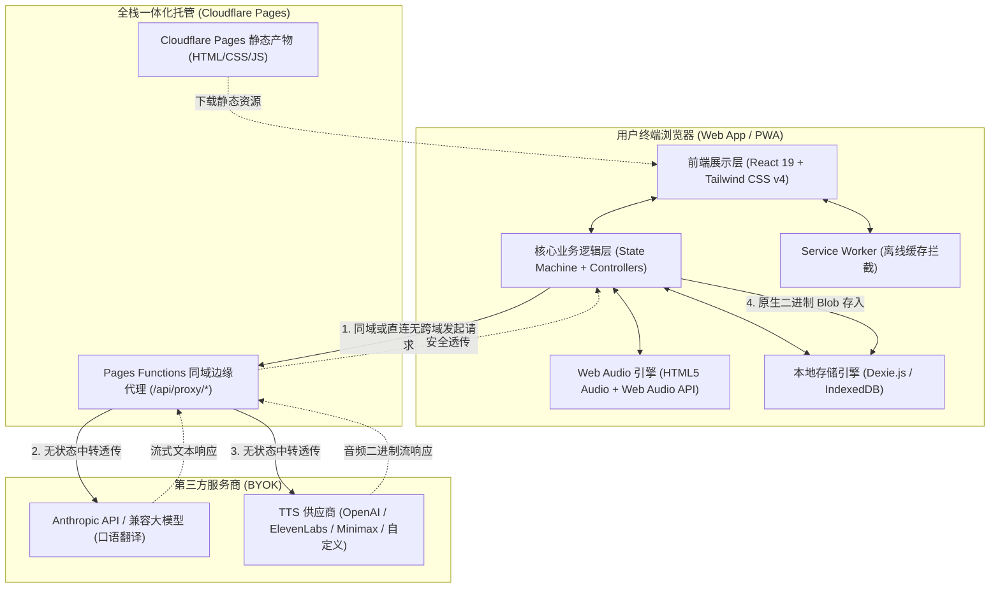
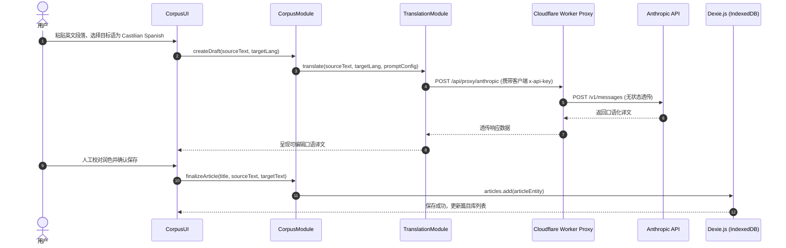
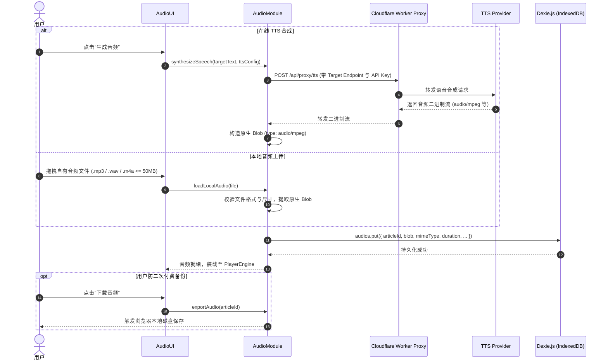
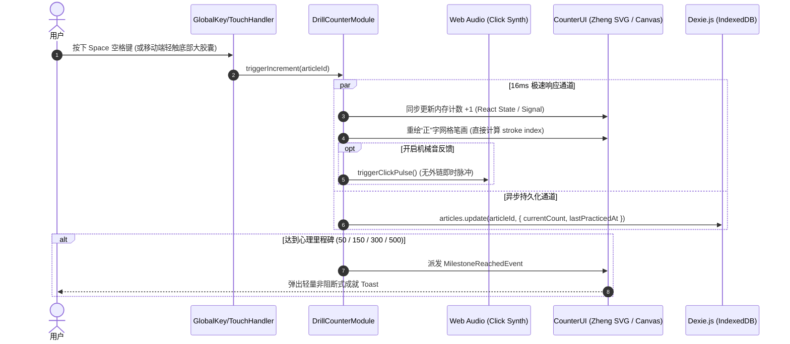
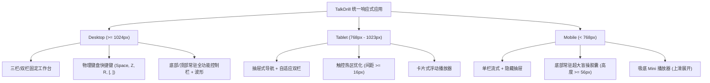

# TalkDrill - System Architecture Document

## 1. System Overview & Architecture Principles

TalkDrill 是一款面向外语高强度跟读与过度学习（Overlearning）的纯客户端、离线优先（Offline-First）、去中心化 Web 应用程序。系统围绕二语习得影子跟读法设计，聚焦于“精选语料 -> 场景口语翻译 -> 母语级音频磨耳 -> 300至500遍高频肌肉记忆朗读 -> 纸电双轨练习”的高效闭环。

### 1.1 核心架构原则

- **纯客户端离线优先 (Client-Centric & Offline-First)**：所有业务计算、语料数据、打卡计数及音频二进制资产均在浏览器沙箱内运行与持久化。除第三方 AI 模型与 TTS 服务调用外，应用不依赖任何中央业务后端。
- **解耦式 BYOK (Bring Your Own Key)**：用户自带第三方模型凭据（Anthropic 兼容接口与多厂商 TTS 接口）。凭据仅存储在客户端本地，翻译与语音服务完全解耦独立配置。
- **无状态边缘反代网关 (Stateless Edge Proxy)**：针对浏览器直连部分外部 API 面临的跨域资源共享（CORS）限制，系统内置基于 Cloudflare Pages Functions 的同域无状态边缘代理（`functions/api/proxy/`），一站式发布，同时支持前端直连任何兼容 CORS 的第三方服务。网关仅负责透传请求头与响应流，严禁落盘或缓存任何私有语料与密钥。
- **超低延迟响应交互**：打卡交互到界面视觉刷新延迟控制在 16ms 以内（保持 60fps 无掉帧）；本地音频装载延迟控制在 100ms 以内；首屏 Brotli 压缩包控制在 300KB 以内。
- **双轨练习模式支持**：屏幕交互工作台（全端响应式、物理键盘盲操、大尺寸触控胶囊）与实体纸质朗读排版（`@media print` 样式、60/100 格“正”字打卡网格表）同源共生。

---

## 2. High-Level Architecture (C4 Context & Container)

系统采用静态托管 + 边缘无状态管道 + 本地存储的现代 Serverless 拓扑架构：

---

## 3. Module Decomposition & Boundaries

系统严格划分为八大独立、低耦合的功能模块，各模块具备明确的 TypeScript 接口边界：

```mermaid
graph LR
    subgraph Presentation ["展示层"]
        CorpusUI[语料管理视图]
        PlayerUI[跟读播放器视图]
        CounterUI[打卡与正字视图]
        PrintUI[纸质打印排版视图]
        SettingsUI[系统设置面板]
    end

    subgraph Domain ["领域与引擎层"]
        CorpusMod[CorpusModule]
        TransMod[TranslationModule]
        AudioMod[AudioModule]
        PlayerMod[PlayerEngine]
        DrillMod[DrillCounterModule]
        PrintMod[PrintExportModule]
    end

    subgraph Infrastructure ["基础设施层"]
        StorageMod[StorageModule - Dexie.js]
        NetworkMod[NetworkClient - Fetch/Worker]
        AudioContextMod[WebAudioContextManager]
    end

    Presentation --> Domain
    Domain --> Infrastructure
```

### 3.1 模块职责与边界定义

#### 1. CorpusModule (语料管理模块)
- **职责**：处理文本输入（多行粘贴、`.txt` 文件导入解析，体积限制 <= 2MB）；判定语言模式（模式 A：需口语翻译；模式 B：直通目标外语）；管理本地篇目的新建、重命名、归档与删除。
- **输入**：用户粘贴文本、上传的 `File` 对象、语言模式选择。
- **输出**：结构化 `Article` 实体，持久化至 `StorageModule`。

#### 2. TranslationModule (场景化口语翻译模块)
- **职责**：将源语言文本转化为地道自然的目标口语表达；封装 Anthropic messages 协议请求体；注入系统预置的口语化 Prompt；支持用户自定义 Prompt 覆盖；提供翻译产物二次人工润色接口。
- **输入**：源文本、目标语种、自定义 Prompt（可选）、API 凭据配置。
- **输出**：口语化目标文本（可编辑字符串）。

#### 3. AudioModule (音频资产管理模块)
- **职责**：对接第三方 TTS 接口拉取示范音频流；处理用户本地自有音频上传（`.mp3`, `.wav`, `.m4a`，体积限制 <= 50MB）；将二进制音频转换为原生 `Blob` 持久化至 IndexedDB；提供音频文件导出下载功能。
- **输入**：目标文本、TTS 配置（或本地上传音频文件）。
- **输出**：音频实体 `AudioItem`（含二进制 `Blob` 与元数据）。

#### 4. PlayerEngine (跟读音频播放引擎)
- **职责**：基于 HTML5 Audio 与 Web Audio API 构建；实现变调不变速（Pitch-preserving）的档位倍速切换（0.5x, 0.75x, 1.0x, 1.25x, 1.5x）；提供微秒级精度的 A-B 段落循环播放；实现微步快进快退（2s/5s）；管理移动端 Safari/Chrome 的 AudioContext 用户手势解锁。
- **输入**：音频 Blob、播放控制指令（播放、暂停、跳转、倍速、A-B 标记）。
- **输出**：播放进度、当前状态（Playing, Paused, Looping, Ended）。

#### 5. DrillCounterModule (低阻力打卡与正字统计模块)
- **职责**：捕获全局物理按键（Space 盲操打卡、Z 键撤销）；响应全平台触控热区（移动端底部大胶囊按钮）；驱动中国传统“正”字网格逐笔矢量渲染；计算四级心理里程碑（50/150/300/500 次）；提供可选机械音效合成；支持手动数字修正弹窗。
- **输入**：打卡触发事件、撤销事件、手动设值事件。
- **输出**：当前篇目最新计数、正字笔画状态、里程碑达成事件。

#### 6. PrintExportModule (纸质排版与多端导出模块)
- **职责**：响应打印触发，激活 `@media print` 样式（自动隐去 UI 组件，设置 16pt-18pt 字号与 2.2 行高）；动态生成 60 或 100 格正方形空白打卡方格表；提供带方格模板的标准 Markdown 导出及系统剪贴板富文本复制。
- **输入**：篇目正文、用户选择的方格数（60 / 100）。
- **输出**：浏览器原生打印调用、Markdown 文件流、富文本剪贴板数据。

#### 7. StorageModule (本地存储基础设施模块)
- **职责**：封装 `Dexie.js`，管理 IndexedDB 数据库连接、表结构版本迁移及事务；执行篇目与音频 Blob 的增删改查；监控浏览器磁盘配额与无痕模式；提供“清空全部本地数据”的安全抹除能力。
- **输入**：实体数据读写请求。
- **输出**：类型安全的实体对象或 Blob 流。

#### 8. EdgeProxy (边缘反向代理模块)
- **职责**：部署于 Cloudflare Workers，单向代理跨域 HTTP 请求；透传客户端传入的 API Key Header；处理分块传输与流式响应（SSE / Chunked Transfer）；严格遵循无状态（Stateless）管道模式，零缓存零落盘。
- **输入**：客户端代理请求。
- **输出**：第三方 API 的无状态代理响应。

---

## 4. Component Sequence & Data Flows

### 4.1 语料录入与口语翻译数据流 (Mode A)

### 4.2 音频获取与本地 Blob 持久化数据流

### 4.3 毫秒级跟读打卡与正字网格渲染流

---

## 5. Non-Functional Implementation Strategies

### 5.1 性能预算与首屏优化策略 (<= 300KB Brotli)
1. **构建与打包优化**：
   - 采用 Vite + Rollup 进行现代 ESM 打包，启用针对现代浏览器（ES2022+）的 Target 构建，移除过时的 Polyfills。
   - 依赖项严选：本地数据库选用轻量级 `dexie`；矢量图标按需导入 `lucide-react`；严禁引入大型全家桶框架（如 Moment.js、Lodash 全量包）。
   - 路由与工作台组件级代码拆分（Dynamic `import()`），非首屏的核心设置面板与打印预览组件采用按需懒加载。
2. **打卡交互 16ms 极致保证**：
   - 打卡状态流采用无阻塞纯同步状态更新，严禁在打卡调用链中执行任何阻塞式的 `await db.put()` 等待。
   - 数据库更新采用“乐观更新 + 异步防抖持久化（Debounced Flush）”策略：每次按键瞬时更新内存模型与 DOM 视图，同时在后台异步将最新计数同步至 IndexedDB。
   - “正”字网格采用轻量级内联 SVG 或 Canvas 渲染，笔画状态由纯函数 `getZhengStrokes(count)` 依据简单模运算即时计算（耗时 < 0.1ms）。

### 5.2 音频引擎架构与内存管理 (<= 100ms 装载)
1. **Blob 生命周期管理**：
   - 音频数据从 IndexedDB 读取为原生 `Blob` 后，调用 `URL.createObjectURL(blob)` 转换为本地临时 URL 赋予 HTML5 Audio 元素。
   - 当用户切换篇目或组件卸载时，严格触发 `URL.revokeObjectURL(currentUrl)`，防止多媒体二进制数据在浏览器堆内存中累积导致泄漏。
2. **变调不变速实现机制**：
   - 利用 HTML5 Audio 原生 `playbackRate` 与 `preservesPitch = true`（现代浏览器默认标准）实现 0.5x 至 1.5x 高质量变调不变速。
3. **微秒级 A-B 循环实现**：
   - 使用 Web Audio API `AudioContext.currentTime` 配合高频 `requestAnimationFrame`（或 AudioBufferSourceNode 循环切片）监听播放头。
   - 当播放头到达标记点 B 时，毫秒级无缝将 `currentTime` 重置为标记点 A，杜绝断点跳跃产生的爆音与卡顿。

### 5.3 移动端与全平台音频自动激活 (User Gesture Unlock)
- 针对 iOS Safari 与 Android Chrome 的自动播放策略（Autoplay Policy）：
  - 系统内置单例 `AudioContextManager`。
  - 在页面任意首次用户轻触（`touchstart` / `pointerdown` / `click`）事件中，静默执行 `audioContext.resume()`。
  - 将激活状态置为 `unlocked`，确保后续所有播放与机械音反馈畅通无阻。

---

## 6. Security & Privacy Architecture

### 6.1 去中心化与零遥测 (Privacy-First)
- 系统不设立任何集中式用户账号数据库，杜绝收集用户 IP、设备指纹、阅读篇目或打卡习惯。
- 严禁引入任何第三方埋点统计（如 Google Analytics、Baidu Tongji）及广告 SDK。

### 6.2 BYOK 密钥客户端安全隔离
- 用户输入的 Anthropic API Key 与 TTS Provider Key 仅存放在用户浏览器本地沙箱（IndexedDB 专属 `settings` 表）。
- 密钥不与任何第三方中心服务器同步，仅在用户主动发起翻译或 TTS 生成时，作为 HTTP Authorization Header 发送至用户指定的 Base URL（或自建 Cloudflare Worker）。

### 6.3 Cloudflare Worker 无状态管道安全规范
- **Stateless Pipeline**：Worker 内存不保存任何请求上下文，请求处理完毕即刻释放。
- **Header 透传与清洗**：仅保留目标服务商所需的鉴权头（如 `x-api-key`, `Authorization`），剥离客户端敏感指纹。
- **CORS 保护**：限制仅允许用户自定的生产域名发起访问，配置安全的 CORS 预检（`OPTIONS`）响应头。

---

## 7. Cross-Platform Responsive Design

---

## 8. Deployment & CI/CD Architecture

### 8.1 部署架构
- **全栈一体化托管 (Cloudflare Pages & Pages Functions)**：
  - 代码提交至 Git 仓库后，自动触发 Cloudflare Pages 构建（命令：`npm run build`）。
  - 构建产物（HTML、JS、CSS、Web Manifest）推送到全球 Cloudflare Anycast 边缘网络，开启 Brotli 自动压缩与 HTTP/3。
  - `functions/` 目录随前端自动编译部署为同域 Edge Functions（`/api/proxy/*`），无需单独维护另外的独立 Worker。

---

## 9. Architectural Decision Records (ADRs)

### ADR-1: 本地存储引擎选择 Dexie.js (IndexedDB) 而非 LocalStorage
- **背景**：系统需要存储大量长篇双语语料，且关键资产为在线合成或用户上传的二进制音频文件（单文件高达 50MB）。
- **决策**：选用 `Dexie.js` 封装 `IndexedDB`，音频直接以原生二进制 `Blob` 存入，严禁使用 `localStorage`。
- **后果**：
  - *优势*：存储上限达本地可用磁盘空间的 50% 以上（通常数十 GB）；避免了 Base64 编码带来的 33% 额外内存开销与 CPU 编解码延迟；具备强类型查询能力。
  - *代价*：API 为异步设计，打卡计数需采用内存状态同步刷新与异步防抖写回机制。

### ADR-2: 采用 Cloudflare Pages Functions 作为同域无状态反代而非分离部署全功能后端
- **背景**：纯前端直连部分第三方 LLM 或 TTS API 存在浏览器 CORS 跨域限制，且需保护用户自备密钥不被集中式服务器滥用。
- **决策**：基于 Cloudflare Pages 内置的 Pages Functions 特性（`functions/api/proxy/`），与前端静态页面同域一体化部署，提供轻量无状态中转。同时前端支持直连任何开放 CORS 的第三方兼容端点。
- **后果**：
  - *优势*：零服务器租赁与维护成本；单命令一键部署；同源调用零 CORS 困扰；隐私完全自持。
  - *代价*：要求托管平台支持 Cloudflare Pages 或兼容的 Edge Functions 环境。

### ADR-3: 音频引擎采用原生 HTML5 Audio + Web Audio 混合架构
- **背景**：需要兼顾超低延迟、变调不变速（Pitch preservation）、微秒级 A-B 循环与极小打包体积。
- **决策**：核心长音频流由 HTML5 Audio 配合 `preservesPitch` 驱动，打卡机械音效与 A-B 循环辅助由 Web Audio API 驱动，不引入 Howler.js 或 Tone.js 等第三方重型音频库。
- **后果**：
  - *优势*：零外部依赖体积开销（节约 50KB+）；充分利用浏览器硬件加速与原生流式解码能力。
  - *代价*：需要自行封装处理 iOS Safari 的用户手势 AudioContext 解锁逻辑。

### ADR-4: “正”字统计采用纯函数矢量 SVG/Canvas 渲染而非自定义图标字体
- **背景**：用户打卡每次递增一笔，需要精确展示 1 至 5 笔的中国传统“正”字笔画，且在 300 至 500 遍时呈现整齐网格。
- **决策**：通过纯数学模运算与 SVG 路径（或 Canvas）即时绘制，笔画按顺序精确映射（1: 一, 2: 丄, 3: 上, 4: 止, 5: 正）。
- **后果**：
  - *优势*：无字体文件网络加载等待；笔画与方格可随窗口尺寸无级平滑缩放；渲染性能开销极低。
  - *代价*：需编写标准的 SVG 笔画路径矢量定义与单元测试。
