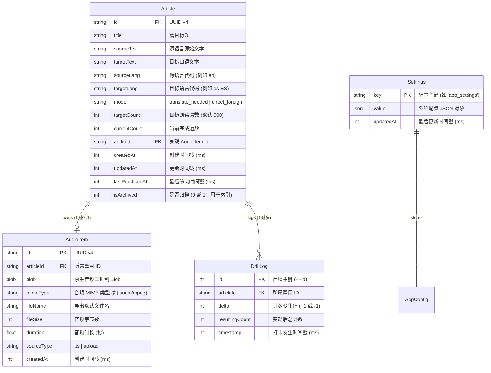

# TalkDrill - Database & Storage Design Document

## 1. Storage Architecture Overview

TalkDrill 坚持纯客户端离线优先与去中心化设计，所有业务数据（语料文本、练习计数、会话日志、用户设置）以及多媒体二进制资产（示范音频）完全驻留在用户的浏览器本地存储沙箱中。

### 1.1 存储技术选型与规范

- **存储引擎**：基于 W3C 标准的浏览器底层 `IndexedDB`。
- **ORM 封装层**：采用行业标准库 `Dexie.js` 提供强类型支持、优雅的 Promise 链式查询以及事务保证。
- **禁止使用 LocalStorage 存储正文与媒体**：
  - 浏览器的 `localStorage` 具有严苛的容量限制（通常仅 5MB 至 10MB），且为同步阻塞 I/O，存储大文本或高频读写将引发明显的 UI 掉帧。
  - 所有文章正文、音频文件与计数严格持久化于 IndexedDB 中。
- **音频原生二进制 Blob 存储规范**：
  - 音频以浏览器原生 `Blob` 对象直接存入 IndexedDB。
  - 杜绝使用 Base64 编码字符串存储，消除 Base64 带来的 33% 额外磁盘占用以及 JavaScript 堆内存编解码开销。

---

## 2. Entity-Relationship Diagram (ERD)



---

## 3. Schema Definitions & Table Specifications

数据库名称固定为：`TalkDrillDB`。

### 3.1 表结构: `articles` (篇目与语料表)

| 字段名称 | 类型 | 主键/索引 | 默认值 | 约束说明 |
|---|---|---|---|---|
| `id` | `string` | **PK** | - | UUID v4 唯一标识字符串 |
| `title` | `string` | - | `""` | 篇目标题，截取正文首行或用户自定义 |
| `sourceText` | `string` | - | `""` | 英文或源语言原始输入段落 |
| `targetText` | `string` | - | `""` | 最终供跟读练习的目标外语口语文本 |
| `sourceLang` | `string` | - | `"en"` | BCP 47 语言代码 |
| `targetLang` | `string` | **Index** | `"es-ES"` | 目标外语代码，支持按语言筛选 |
| `mode` | `string` | **Index** | `"translate_needed"` | 枚举：`translate_needed` 或 `direct_foreign` |
| `targetCount` | `number` | - | `500` | 目标练习遍数，非负整数 |
| `currentCount` | `number` | - | `0` | 当前累计练习完成遍数，必须 `>= 0` |
| `audioId` | `string` | - | `undefined` | 对应 `audios` 表的主键 `id`（可选） |
| `createdAt` | `number` | **Index** | 当前时间戳 | 记录创建时间 (毫秒) |
| `updatedAt` | `number` | - | 当前时间戳 | 记录最后修改时间 (毫秒) |
| `lastPracticedAt` | `number` | **Index** | `undefined` | 最近一次触发打卡的时间戳 |
| `isArchived` | `number` | **Index** | `0` | 归档标志，`0` 表示活跃，`1` 表示归档 |

**Dexie 索引字符串**：`id, targetLang, mode, isArchived, lastPracticedAt, createdAt`

---

### 3.2 表结构: `audios` (音频二进制资产表)

| 字段名称 | 类型 | 主键/索引 | 默认值 | 约束说明 |
|---|---|---|---|---|
| `id` | `string` | **PK** | - | UUID v4 音频资产标识符 |
| `articleId` | `string` | **Index** | - | 关联篇目的 `id`，建立外键索引便于清理 |
| `blob` | `Blob` | - | - | 浏览器原生二进制音频流（不加索引） |
| `mimeType` | `string` | - | `"audio/mpeg"` | 音频 MIME，如 `audio/mpeg`、`audio/wav` |
| `fileName` | `string` | - | `"drill-audio.mp3"` | 下载导出的默认建议文件名 |
| `fileSize` | `number` | - | `0` | 文件体积字节数（单文件限制 `<= 50MB`） |
| `duration` | `number` | - | `0` | 音频总时长（单位：秒） |
| `sourceType` | `string` | - | `"tts"` | 枚举值：`tts` 或 `upload` |
| `createdAt` | `number` | - | 当前时间戳 | 音频生成或导入时间戳 |

**Dexie 索引字符串**：`id, articleId`

---

### 3.3 表结构: `drillLogs` (打卡历史与审计流水表)

用于支持操作撤销（Undo）、历史练习趋势分析以及细粒度防误触审计。

| 字段名称 | 类型 | 主键/索引 | 默认值 | 约束说明 |
|---|---|---|---|---|
| `id` | `number` | **PK (++)** | 自增 | 自增整数流水号 |
| `articleId` | `string` | **Index** | - | 关联的篇目 `id` |
| `delta` | `number` | - | `1` | 变动数值：`+1`、`-1` 或手动修正差值 |
| `resultingCount` | `number` | - | - | 该动作执行后的最新计数值 |
| `timestamp` | `number` | **Index** | 当前时间戳 | 打卡操作时间戳 (毫秒) |

**Dexie 索引字符串**：`++id, articleId, timestamp`

---

### 3.4 表结构: `settings` (系统配置键值表)

| 字段名称 | 类型 | 主键/索引 | 默认值 | 约束说明 |
|---|---|---|---|---|
| `key` | `string` | **PK** | - | 唯一配置项键，例如 `"app_settings"` |
| `value` | `object` | - | `{}` | 序列化的配置对象（强类型契约） |
| `updatedAt` | `number` | - | 当前时间戳 | 配置最后更新时间戳 |

**Dexie 索引字符串**：`key`

---

## 4. TypeScript Implementation (Dexie.js Schema)

以下为符合零告警、零 `any`、强类型标准的 Dexie 数据库实现代码，置于 `src/storage/db.ts`：

```typescript
import Dexie, { type EntityTable } from 'dexie';

export type LanguageMode = 'translate_needed' | 'direct_foreign';

export interface ArticleRecord {
  id: string;
  title: string;
  sourceText: string;
  targetText: string;
  sourceLang: string;
  targetLang: string;
  mode: LanguageMode;
  targetCount: number;
  currentCount: number;
  audioId?: string;
  createdAt: number;
  updatedAt: number;
  lastPracticedAt?: number;
  isArchived: number; // 0: 活跃, 1: 归档 (便于索引查询)
}

export interface AudioRecord {
  id: string;
  articleId: string;
  blob: Blob;
  mimeType: string;
  fileName: string;
  fileSize: number;
  duration: number;
  sourceType: 'tts' | 'upload';
  createdAt: number;
}

export interface DrillLogRecord {
  id?: number;
  articleId: string;
  delta: number;
  resultingCount: number;
  timestamp: number;
}

export interface SettingsRecord<T = unknown> {
  key: string;
  value: T;
  updatedAt: number;
}

export class TalkDrillDatabase extends Dexie {
  articles!: EntityTable<ArticleRecord, 'id'>;
  audios!: EntityTable<AudioRecord, 'id'>;
  drillLogs!: EntityTable<DrillLogRecord, 'id'>;
  settings!: EntityTable<SettingsRecord, 'key'>;

  constructor() {
    super('TalkDrillDB');

    // 版本 1 Schema 定义
    this.version(1).stores({
      articles: 'id, targetLang, mode, isArchived, lastPracticedAt, createdAt',
      audios: 'id, articleId',
      drillLogs: '++id, articleId, timestamp',
      settings: 'key',
    });
  }
}

export const db = new TalkDrillDatabase();
```

---

## 5. Binary Blob Management & Memory Lifecycle

浏览器在处理大型多媒体 `Blob` 时若管理不善极易引发内存泄漏或导致主线程卡顿。TalkDrill 规定严格的生命周期标准：

```mermaid
flowchart LR
    IDB[(IndexedDB: audios 表)] -->|1. db.audios.get(id)| BlobObj[原生二进制 Blob]
    BlobObj -->|2. URL.createObjectURL(blob)| ObjectUrl[blob:https://... 临时 URL]
    ObjectUrl -->|3. audio.src = objectUrl| AudioElem[HTML5 Audio 播放器]
    AudioElem -->|4. 篇目切换或组件卸载| Revoke[URL.revokeObjectURL(objectUrl)]
```

### 5.1 内存安全操作准则
1. **URL 对象及时释放**：
   - 每次为 `audio.src` 赋予 `URL.createObjectURL(blob)` 产生的 URL 时，记录在播放器实例上下文中。
   - 在用户切换下一篇目、删除音频或组件卸载（React `useEffect` cleanup）时，必须同步触发 `URL.revokeObjectURL(url)`，将底层分配的堆内存立即交还浏览器内核。
2. **级联删除保障**：
   - 当用户从 `articles` 表删除一篇文章时，必须开启 Dexie 事务同时删除 `audios` 表中对应的关联记录及 `drillLogs` 中的历史记录：
     ```typescript
     await db.transaction('rw', [db.articles, db.audios, db.drillLogs], async () => {
       await db.articles.delete(articleId);
       await db.audios.where('articleId').equals(articleId).delete();
       await db.drillLogs.where('articleId').equals(articleId).delete();
     });
     ```

---

## 6. Storage Quota, Persistence & Capacity Management

### 6.1 配额侦测与空间监控
现代浏览器为 IndexedDB 开放单源（Origin）多达数十 GB 的存储配额，但在隐身模式（Private Browsing）或磁盘极度紧张时会施加限制。

应用在初始化时通过标准 API 侦测可用空间：

```typescript
export interface StorageEstimateResult {
  quotaBytes: number;
  usageBytes: number;
  percentageUsed: number;
  isPersistent: boolean;
}

export async function checkStorageCapacity(): Promise<StorageEstimateResult> {
  if (navigator.storage && navigator.storage.estimate) {
    const { quota = 0, usage = 0 } = await navigator.storage.estimate();
    const isPersistent = navigator.storage.persisted 
      ? await navigator.storage.persisted() 
      : false;
    
    return {
      quotaBytes: quota,
      usageBytes: usage,
      percentageUsed: quota > 0 ? (usage / quota) * 100 : 0,
      isPersistent,
    };
  }
  return { quotaBytes: 0, usageBytes: 0, percentageUsed: 0, isPersistent: false };
}
```

### 6.2 持久化存储授权 (Persistent Storage API)
为规避移动端 Safari 在磁盘空间吃紧时静默逐出 IndexedDB 数据的风险（响应 PRD 中的 OQ-1），应用在用户累计创建达到 3 篇语料或生成首个音频后，主动触发持久化请求：

```typescript
export async function requestPersistentStorage(): Promise<boolean> {
  if (navigator.storage && navigator.storage.persist) {
    return await navigator.storage.persist();
  }
  return false;
}
```

---

## 7. Backup, Export, and Privacy Purge Workflows

### 7.1 本地数据完整备份与导出格式
用户可随时将整库数据导出为单份自包含的 JSON 文件（支持选择是否内联音频 Base64 以供完整迁移）：

```json
{
  "version": 1,
  "exportedAt": 1791000000000,
  "articles": [
    {
      "id": "c1a9c394-4b5b-4c54-9bb6-324200000001",
      "title": "Restaurante en Madrid",
      "sourceText": "Could we have the bill, please?",
      "targetText": "¿Nos cobras, por favor?",
      "sourceLang": "en",
      "targetLang": "es-ES",
      "mode": "translate_needed",
      "targetCount": 500,
      "currentCount": 320,
      "createdAt": 1790900000000,
      "updatedAt": 1790950000000,
      "lastPracticedAt": 1790950000000,
      "isArchived": 0
    }
  ],
  "settings": {
    "audioFeedback": {
      "mechanicalClick": true
    },
    "printOptions": {
      "defaultTallyBoxes": 100
    }
  }
}
```

### 7.2 一键抹除全部本地数据 (Privacy Purge)
为捍卫去中心化与个人隐私保护原则，设置界面提供“清空所有数据”红色危险区：
- 提示两次确认对话框。
- 执行原子删除：`await db.delete()` 并清除可能存在的任何相关本地缓存。
- 页面自动刷新重置为初始干净状态。
