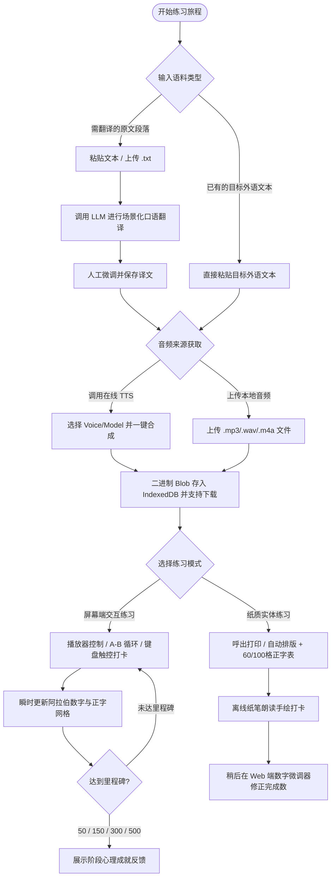

# TalkDrill - Product Requirements Document (PRD)

## 1. Executive Summary

TalkDrill 是一款面向追求地道“听”与“说”能力的外语学习者的高强度跟读强化 Web 工具。产品植根于第二语言习得（Second Language Acquisition, SLA）理论中的影子跟读法（Shadowing）与过度学习（Overlearning）机制，旨在通过“精选语料 -> 地道口语翻译 -> 母语级音频磨耳 -> 300至500遍高频肌肉记忆朗读”的闭环训练体系，协助学习者直接打通“听觉感知-发音器官肌肉运动”的神经反射回路，彻底消除中介语心译延迟，实现外语脱口而出。

产品坚持纯客户端离线优先与去中心化设计：无需注册集中式云端账号，所有语料文本、练习计数与音频二进制资产完全存储在浏览器本地（IndexedDB / Dexie.js）。第三方大模型翻译与语音合成能力采用 BYOK（Bring Your Own Key）模式完全解耦自持，配合无状态边缘反向代理（Cloudflare Workers）解决跨域问题。此外，产品首创“屏幕端极低阻力打卡”与“纸质实体排版打印（含 60/100 格正字打卡表）”的双轨练习模式，全方位覆盖桌面、平板与移动端多维使用场景。

---

## 2. Background

在外语学习过程中，大多数具备良好外语词汇量与阅读能力的进阶学习者普遍面临“能看懂、听懂慢，但自己说不出来”的发音与表达瓶颈。认知神经学与二语习得研究表明，产生该现象的根本原因在于大脑在输出语言时存在冗长的大脑中介语心译链条（目标语言 -> 母语心译 -> 语法组装 -> 口腔发音）。

要打破这一心译延迟，必须借助高强度影子跟读（Shadowing）与过度学习（Overlearning）。经典研究显示，当单句或短篇语料经过 300 至 500 遍的物理复诵后，大脑对音素节奏与肌肉位置的控制将从“受控意识处理”转变为“自动化神经反射”。然而，当前市面上的主流外语学习产品普遍存在以下问题：
1. 界面充斥复杂的语法解析、繁琐的选择题与社交打卡，导致极高的认知负担与注意力分散。
2. 缺乏针对难点断句的精细 A-B 循环与数百次打卡记录支持。
3. 强制云端绑定与高额订阅，用户自备的高质量语料与生成音频无法自由导出与安全持久化。
4. 忽视纸质打印阅读的实体学习价值，未能实现数字伴随与纸质大声朗读的有机互补。

TalkDrill 为此而生，为严肃自律的学习者提供极致纯粹、无干扰、全离线、低阻力的高强度跟读训练工具。

---

## 3. Problem Statement

目标用户面临的具体痛点如下：
- **痛点 1: 中介语翻译延迟严重**：在真实表达场景中无法自发直觉回应，必须在大脑中完成复杂的句式拆解与语法匹配。
- **痛点 2: 练习工具认知摩擦过大**：学习软件界面杂乱、流程冗长，缺乏能让人即刻进入“听-读-记”沉浸循环的极简界面。
- **痛点 3: 缺少过度学习支撑机制**：缺乏专业级播放控制（微秒级 A-B 循环、变调不变速）与 300 至 500 次的击穿式练习可视化跟踪。
- **痛点 4: 数字场景与纸质朗读割裂**：用户在桌前喜欢使用纸笔朗读勾画，但在打印时排版混乱、缺少配套音频索引与纸面量化打卡表。
- **痛点 5: 隐私与资产所有权缺失**：私有生僻语料与高成本生成的优质 TTS 音频受制于平台厂商，一旦网络受阻或缓存清除即面临资产丢失与重复付费。

---

## 4. Product Vision Alignment

根据 [docs/Vision.md](file:///Users/victorxu/projects/talkdrill/docs/Vision.md)，TalkDrill 的核心价值定位如下：
- **神经回路重塑**：通过纯粹的声音输入与口腔肌肉复诵，跳过中介语心译，构建声音到口腔发音肌群的直觉映射。
- **零认知负担体验**：界面严控视觉噪音，剥离语法分析与记忆卡牌，聚焦于语料呈现、音频磨耳与瞬时打卡。
- **双轨练习生态贯通**：屏幕端打卡与纸质排版打印协同互补，无论脱网、书房还是通勤均可无缝衔接。
- **去中心化与隐私优先**：全栈数据本地自持，第三方模型与语音合成解耦，零云端数据上报。
- **全平台自适应**：跨越 Desktop、Tablet、Mobile 视口与交互形态，实现键盘盲操与拇指单手流利打卡。

---

## 5. Goals

- **G-1: 极简语料闭环**：支持纯文本粘贴与 .txt 导入，支持需翻译模式（调用 LLM 输出地道口语）与直接录入模式（跳过翻译直达音频）。
- **G-2: 独立音频工作台**：支持自持配置调用主流 TTS 接口（OpenAI、ElevenLabs、Minimax、自定义）生成音频，支持用户上传自有音频，统一以 Blob 二进制存入 IndexedDB 并支持音频导出。
- **G-3: 专业级跟读播放器**：提供微步快进快退（2s/5s）、变调不变速调节（0.5x 至 1.5x）、高精度 A-B 段落循环播放。
- **G-4: 超低摩擦打卡与正字统计**：实现桌面 Space 盲操打卡、移动端底部大热区单手打卡；打卡延迟 <= 16ms；具备撤销与任意次数手动修正能力；提供 50/150/300/500 四级心理里程碑激励与标准“正”字网格渲染。
- **G-5: 专属纸质排版与多端导出**：专属 `@media print` 样式自动隐藏 UI 控件并放大字号与行高；末尾自动生成 60 或 100 格空白方格打卡表；支持一键导出 Markdown 与带格式富文本。
- **G-6: 全离线 PWA 与零维护成本**：配置 Service Worker 与 Web App Manifest，脱网状态下已保存内容 100% 可用；纯静态托管于 Cloudflare Pages，边缘代理使用无状态 Cloudflare Workers。

---

## 6. Non-goals

以下功能特性在当前版本及近中期规划中明确排除（参见 [docs/Vision.md](file:///Users/victorxu/projects/talkdrill/docs/Vision.md) 与 [docs/Constraints.md](file:///Users/victorxu/projects/talkdrill/docs/Constraints.md)）：
- **NG-1: 不构建中心化用户系统与云端数据库**：不提供用户注册、登录、OAuth 第三方认证，不维护集中式文章与打卡数据仓库。
- **NG-2: 不开发 AI 自动发音打分与语音识别纠错 (ASR)**：不引入机器打分算法造成的认知焦虑与打断，发音校验依赖学习者的自我听觉对比与肌肉定型。
- **NG-3: 不引入复杂语法解析、词典与间隔重复 (SRS) 记忆卡牌**：不实现语法树标注、词性高亮与划词弹窗查词，保持核心发音复诵纯粹性。
- **NG-4: 不提供多设备云端自动化实时同步**：初期不依赖云端机制进行跨终端的实时双向状态同步。
- **NG-5: 不提供中心化媒体托管与公共语料广场**：不搭建社区分享中心、公开排行榜或公开音频分发 CDN。

---

## 7. Target Users

- **高阶外语突破者**：具备良好英语读写基础，正在攻克第二/第三外语（如卡斯蒂利亚西班牙语、日语、法语等）口语听力瓶颈的学习者。
- **肌肉记忆信奉者**：高度认可二语习得影子跟读法，追求母语级语调连贯感，愿意针对单篇语料投入 300 至 500 遍深度复诵的严肃自律学习者。
- **隐私与自主控制偏好者**：注重个人数据所有权，习惯自带 API 密钥（BYOK），偏好极简、无广告、无社交干扰的专业工具型用户。
- **多场景混用练习者**：习惯在书房利用桌面大屏与打印纸质材料深度朗读，同时利用碎片通勤时间使用手机或平板进行跟读打卡的用户。

---

## 8. Personas

### Persona 1: Elena (卡斯蒂利亚西班牙语高阶突破者 - 深度纸电双轨练习)
- **背景**：跨国企业项目经理，英语流利，正在备考 DELE B2/C1 口语。
- **核心诉求**：日常需要将英文业务汇报材料翻译为地道、自然的西班牙本土口语表达；在书房偏好打印出纸质文本，手持铅笔边听边大声朗读，并在纸末空白正字表格中划线打卡；完成 300 遍后在屏幕端做最终流利复核。
- **典型使用习惯**：桌面端录入文本 -> 选择 Castilian Spanish 口语翻译 -> 生成 TTS 音频 -> 发起打印输出（带 60 格打卡表） -> 导出音频备份 -> 离线纸笔朗读打卡。

### Persona 2: Kenji (碎片化通勤高频跟读练习者 - 移动端单手盲操)
- **背景**：移动应用工程师，日语学习者，每天乘坐公共交通通勤 1 小时。
- **核心诉求**：在拥挤的地铁车厢中佩戴耳机听示范音频，单手握持手机，手指无需精确注视屏幕即可快速按压大面积打卡按钮进行跟读计数；针对某句含促音或浊音的难句进行 A-B 单曲循环磨耳。
- **典型使用习惯**：手机浏览器/PWA 打开应用 -> 选取当前进行中的篇目（已存 180 / 500） -> 开启 0.75x 慢速和 A-B 循环听音 -> 跟读一句拇指盲按底部大胶囊打卡 -> 感受正字笔画实时延展。

---

## 9. User Journeys



### Detailed Steps:
1. **录入与解析**：用户进入首页，点击“新建篇目”。粘贴英文材料或直接粘贴目标语言。系统支持拖拽 `.txt` 文件（<= 2MB）。
2. **场景化口语翻译（如适用）**：对于模式 A，用户选择目标语言（如卡斯蒂利亚西班牙语）。系统注入专用口语 Prompt 经由本地配置的 Anthropic 协议接口请求生成。生成后用户在输入框中人工润色词句。
3. **音频绑定与本地固化**：系统调用配置好的 TTS 接口（或用户上传自有音频，<= 50MB）。音频二进制流直接写入 IndexedDB。用户可点击“下载音频”保存本地一份以防开销浪费。
4. **跟读磨耳与打卡**：
   - 屏幕模式：使用音频播放器进行 0.5x - 1.5x 无损变速，圈选难句 A-B 循环。桌面端按空格键 `Space`，移动端按底部悬浮胶囊进行打卡。
   - 纸质模式：点击“打印”，系统输出无干扰大字号排版，页面底部附带 60 或 100 格打卡方格表，供纸质手写记录。
5. **里程碑达成与归档**：达到 300 遍（肌肉定型）与 500 遍（脱口而出）后，篇目展示成就徽标并支持归档保存。

---

## 10. User Stories

| ID | 角色 | 行动与需求 | 预期价值与目的 |
|---|---|---|---|
| **US-01** | 外语自学者 | 能够直接粘贴多行文本或上传 .txt 文件创建语料 | 快速导入自己的真实口语训练材料，支持最多 2MB 文本 |
| **US-02** | 进阶学习者 | 能够在系统内调用大模型生成地道本土口语表达并可手动编辑 | 摆脱机械死板的书面直译，获取符合本土人口语习惯的精准句子 |
| **US-03** | 语料练习者 | 能够上传根据目标文本生成的外部示范音频或自有录音，并导出本地备份 | 获得高质量磨耳音频，通过第三方平台灵活生成并导入练习 |
| **US-04** | 影子跟读者 | 能够在播放器中微步跳跃、变调不变速变速及圈定 A-B 循环 | 针对生僻音素和难点连读进行无缝单曲循环突破 |
| **US-05** | 桌面打卡者 | 能够使用物理键盘空格键盲操打卡，按 Z 键撤销误触 | 在沉浸跟读时不中断发音节奏，实现无视觉依赖的极速记录 |
| **US-06** | 移动端用户 | 能够在单手握持手机时通过底部超大按钮单手盲操打卡 | 在通勤或站立场景下提供防误触、低阻力的打卡体验 |
| **US-07** | 视觉激励追求者 | 能够在界面上看到“正”字网格逐笔渲染与 50/150/300/500 里程碑提示 | 明确感知练习量积累，获得扎实的阶段性心理激励反馈 |
| **US-08** | 纸质阅读爱好者 | 能够一键打印整篇语料，并在页末自动附带 60 或 100 个空白打卡方格 | 摆脱电子屏幕蓝光干扰，进行传统沉浸式纸笔大声诵读与划线记录 |
| **US-09** | 格式排版整理者 | 能够将包含打卡表格的篇目导出为 Markdown 或无损复制富文本 | 方便将语料迁移至个人知识库（Obsidian、Word、Google Docs） |
| **US-10** | 隐私敏感型用户 | 能够自主配置独立的翻译 API 凭据，并随时清空全部本地数据 | 确保语料与密钥仅留存在本地设备，无中心化泄露风险 |
| **US-11** | 练习维护者 | 能够随时重新编辑已有篇目（调整源文本草稿、重新翻译、微调目标正文或更换音频）并保留已有练习遍数，无需销毁重建 | 避免因词句小错误或优化表述而导致练习进度丢失 |
| **US-12** | 语料组织者 | 能够将已熟练或暂时停顿的篇目手动归档至专属列表，并能随时将归档篇目还原至活跃状态 | 保持当前训练视口精简聚焦，同时随时可复盘过往语料 |

---

## 11. Functional Requirements

### FR-1: 语料录入与管理模块 (Corpus Input & Management)
- **FR-1.1 输入格式支持**：
  - 支持多行纯文本直接粘贴。
  - 支持点击或拖拽上传 `.txt` 纯文本文件，单文件体积限制 <= 2MB。
- **FR-1.2 语言模式分支**：
  - **模式 A（需翻译）**：输入为英文或其他源语言文本，界面提供目标外语下拉选择（如 Castilian Spanish、Japanese 等），调用翻译引擎。
  - **模式 B（无需翻译）**：直接输入目标外语文本，系统自动识别或由用户勾选“跳过翻译”，直接进入音频配置步骤。
- **FR-1.3 本地文章库管理**：
  - 本地篇目卡片/列表视图展示：标题、目标语言、当前练习次数 / 目标次数（如 128 / 500）、最后练习时间。
  - 提供新建、直接编辑（Edit Drill，保留已有练习进度与打卡日志）、归档（Archive）与彻底删除（Delete）操作。
  - 提供 Active（进行中）与 Archived（已归档）独立视图筛选，已归档篇目支持随时一键还原（Restore）至 Active。
  - 数据模型持久化至 IndexedDB，单机不设篇目数量上限（受浏览器可用磁盘容量约束）。

### FR-2: 场景化口语翻译引擎 (Translation Engine)
- **FR-2.1 协议规范与服务解耦**：
  - 默认遵循 Anthropic API（messages 格式）协议标准。
  - 支持在系统配置中独立配置 Base URL、API Key 与 Model Name（如 `claude-3-5-sonnet-20241022`、`claude-3-5-haiku-20241022` 或兼容反代）。
  - 翻译引擎与应用内其他配置完全解耦，不共享任何敏感凭证。
- **FR-2.2 地道口语化 Prompt 注入**：
  - 内置针对口语流畅度深度优化的系统提示词（System Prompt），明确要求翻译为符合目标语言本土母语者日常对话口吻的用语（如卡斯蒂利亚西班牙语优先使用本土第二人称复数代词与地道动词变位）。
  - 提供高级折叠面板，允许用户查阅、微调或完全覆盖内置的 System Prompt。
- **FR-2.3 文本结果二次编辑**：
  - 翻译结果返回后，外语文本渲染在可编辑多行文本区域中。
  - 用户可进行任意手动字词调整、断句增删，确认保存后作为最终定稿文本。

### FR-3: 音频获取与管理模块 (Audio Engine)
- **FR-3.1 本地与第三方生成音频上传 (核心模式)**：
  - 支持用户通过第三方平台（如 ElevenLabs、OpenAI 等）根据目标外语内容生成音频并上传，或上传自有录制音频。
  - 支持音频格式：`.mp3`、`.wav`、`.m4a`。
  - 单个音频文件体积限制 <= 50MB。
  - 音频为可选配置，支持用户在无音频状态下进行纯文本朗读特训。
- **FR-3.2 在线 TTS 合成支持 (规划中 - 下次大版本升级特性)**：
  - 内置多厂商在线 TTS 一键合成（OpenAI、ElevenLabs、MiniMax 等）作为下一代大版本路线图特性规划，当前版本界面默认关闭该功能以保障产品极致简洁与专注。
- **FR-3.3 二进制持久化与本地下载**：
  - 所有音频统一转换为原生二进制 `Blob` 存入浏览器的 IndexedDB 中，严禁使用 Base64 字符串形式以杜绝内存膨胀。
  - 离线环境下支持直接读取本地 Blob 并通过 `URL.createObjectURL` 装载至播放器。
  - 提供显著的“下载音频文件”按钮，允许用户将音频下载至本地磁盘备份，防止因浏览器清理存储造成数据丢失。

### FR-4: 交互式跟读播放器与练习打卡 (Practice & Drill)
- **FR-4.1 专业级跟读音频播放器**：
  - **核心控制**：播放/暂停切换、微步快进/快退（支持 2 秒与 5 秒切换）。
  - **精细化变速**：支持 0.5x、0.75x、1.0x、1.25x、1.5x 预设档位，使用 Web Audio API 与 HTML5 Audio 实现变调不变速（Pitch-preserving）。
  - **A-B 段落循环**：允许用户在进度条或波形控制区设置起始点 A 与结束点 B，激活循环后仅在 A-B 区间内高频重复播放，满足音素攻坚需求。
- **FR-4.2 超低阻力打卡机制**：
  - **打卡触发形态**：
    - Desktop：按下物理键盘空格键 `Space` 或点击主界面打卡按钮计数 +1。
    - Mobile / Tablet：底部常驻超大悬浮胶囊按钮（高度 >= 56px）或屏幕大面积触控热区轻触计数 +1。
  - **防误触与数字修正**：
    - 提供撤销功能（Desktop 快捷键 `Z`，移动端点击撤销小图标）将计数 -1。
    - 点击计数当前数字弹出数字微调模态框，支持直接键盘输入任意指定完成次数（校验范围：0 至 99999）。
- **FR-4.3 可视化激励与阶段里程碑**：
  - **双重进度展示**：实时并排展示阿拉伯数字进度（如 `342 / 500`）与中国传统“正”字网格（每 5 次打卡完整勾画一个标准“正”字字符，单笔依次对应一、丄、上、止、正）。
  - **四大心理里程碑**：
    - 50 遍：初识音素（Phonetic Familiarity）- 消除生词陌生感。
    - 150 遍：意群连贯（Rhythmic Flow）- 掌握自然连读与语调重音。
    - 300 遍：肌肉定型（Muscle Memory Locked）- 口腔发音器官形成物理定型。
    - 500 遍：自动化脱口而出（Automaticity Mastered）- 形成直觉无意识神经反射。
  - 触发对应里程碑时，界面弹出轻量非阻断式徽标 Toast 提示，并记录达成状态。

### FR-5: 排版打印与多格式导出 (Print & Export Engine)
- **FR-5.1 专属纸质朗读排版规范 (`@media print`)**：
  - 一键点击“打印”呼出浏览器系统打印面板。
  - 打印媒体查询自动隐藏顶部导航、底部播放器、侧边栏、所有打卡按钮与设置控件。
  - 正文字号固定为 16pt 至 18pt，行高设为宽松的 2.2，留足纸面手写国际音标（IPA）与语调连读标记的空间。
- **FR-5.2 纸质“正字打卡表”自动生成**：
  - 用户可在打印对话框中自主选择生成 60 个方格（对应 300 遍练习）或 100 个方格（对应 500 遍练习）。
  - 在打印文档末尾自动排版出标准网格表，每格为正方形留白框，专门供用户手持铅笔进行五笔“正”字划线打卡。
- **FR-5.3 外部导出**：
  - 支持一键导出标准 Markdown 文件（`.md`），内嵌语料文本与对应规格的打卡方格 Markdown 表格。
  - 支持一键复制富文本内容至系统剪贴板，支持直接无损粘贴至 Microsoft Word 或 Google Docs，保持字号与表格排版结构完整。

### FR-6: 系统设置与服务配置隔离 (Decoupled Settings)
- **FR-6.1 配置架构规范**：
  ```typescript
  interface AppSettings {
    translation: {
      enabled: boolean;
      baseUrl: string;        // 默认: https://api.anthropic.com/v1 或反向代理地址
      apiKey: string;
      model: string;          // 默认: claude-3-5-sonnet-20241022
      customPrompt?: string;  // 自定义口语化系统提示词 (向下兼容)
      customPrompts?: Record<string, string>; // 多语种口语翻译提示词映射 (es-ES, ja-JP, fr-FR, de-DE, en-US, default)
    };
    tts: {
      provider: 'openai' | 'elevenlabs' | 'minimaxi' | 'custom';
      baseUrl: string;
      apiKey: string;
      modelOrVoiceId: string; // 发音人或声音模型标识
    };
    printOptions: {
      defaultTallyBoxes: 60 | 100; // 默认打印方格数 (300遍 / 500遍)
    };
  }
  ```
- **FR-6.2 零集中持久化**：
  - 密钥和配置项仅存储在客户端本地，任何配置更改即刻在本地生效。
- **FR-6.3 本地数据管理与清空**：
  - 提供“清空所有本地数据”危险操作区，具备二次确认保护，保障用户完全掌控本地隐私数据。

---

## 12. Non-functional Requirements

### NFR-1: 性能与流畅度指标 (Performance & Responsiveness)
- **构建体积预算**：生产产物经过 Brotli 压缩后，首屏核心 JavaScript 与 CSS 总包体积必须 <= 300KB。
- **首次内容绘制 (FCP)**：在现代宽带及 4G 移动网络下，FCP 必须 <= 1.2s。
- **打卡响应延迟**：点击打卡触发到 UI 界面“正”字笔画渲染及阿拉伯数字刷新的渲染延迟必须 <= 16ms（稳定 60fps，杜绝顿挫）。
- **音频装载延迟**：本地 IndexedDB 二进制 Blob 装载至 Web Audio 播放上下文的初始化耗时 <= 100ms。
- **内存优化**：播放大音频时不产生内存泄漏，离开页面时及时释放 `URL.revokeObjectURL`。

### NFR-2: 存储架构与数据持久化 (Storage & Offline)
- **存储技术选型**：使用 `Dexie.js` 统一封装浏览器的 `IndexedDB`。
- **配额防超限**：单文件导入限制（文本 <= 2MB，音频 <= 50MB）；严禁使用 5MB 配额上限的 `localStorage` 存放音频或语料正文。
- **容错预警**：检测到浏览器处于无痕/隐身模式或存储配额受限时，在界面提示用户导出备份。
- **PWA 全脱网运行**：
  - 部署标准 Web App Manifest，支持移动端“添加到主屏幕”。
  - 注册 Service Worker 实现静态资源 CacheFirst 缓存策略，确保脱网断网时已存篇目、本地音频及打卡功能 100% 顺畅使用。

### NFR-3: 响应式与多端形态规范 (Responsive Viewports)
| 视口规格 | 断点区间 | 页面布局架构 | 打卡交互优化 | 播放器形态与排版 |
|---|---|---|---|---|
| **Desktop** | `>= 1024px` | 双栏或三栏布局（左侧篇目导航、中间工作台、右侧正字与统计面板） | 优先支持键盘快捷键（Space 打卡 +1、Z 撤销、R 重播、`[` / `]` 调节倍速） | 顶部或底部常驻控制栏，完整波形图与快捷键指南，字号 18px-22px |
| **Tablet** | `768px - 1023px` | 可折叠侧边栏抽屉，横屏双栏，竖屏上下堆叠 | 右侧或悬浮大尺寸触控区域，防误触边界保持 `>= 16px` | 浮动卡片式播放器，大触控图标，字号 18px-20px |
| **Mobile** | `< 768px` | 单栏流式布局，侧边栏折叠为 Drawer 抽屉，主体视口全给文本 | 底部固定悬浮超大胶囊打卡按钮（高度 `>= 56px`），支持单手拇指盲操 | 底部紧凑吸底 Mini Player（支持上滑展开完整面板），行高 1.8，字号自适应无水平横滚 |

### NFR-4: 浏览器与系统兼容性 (Compatibility)
- **浏览器矩阵**：全面支持 Chrome 110+、Safari 16.4+、Firefox 115+、Microsoft Edge 最新稳定版。
- **移动端音频解锁 (User Gesture Unlock)**：适配 iOS/iPadOS Safari 及 Android Chrome 的音频自动播放限制策略，在用户首次点击/轻触屏幕时显式解锁 `AudioContext`。

### NFR-5: 安全与隐私规范 (Security & Privacy)
- **零数据上报与分析跟踪**：严禁接入任何 Google Analytics、Mixpanel 等第三方分析 SDK，零跟踪代码，零第三方广告脚本。
- **无状态边缘反代网关 (Cloudflare Workers)**：
  - 代理仅用于解决浏览器直连 LLM 及 TTS API 时的 CORS 跨域请求与流式转发。
  - Worker 遵循严格的无状态（Stateless）管道模式，单向透传 Header 中的 API Key，严禁在边缘端缓存、持久化或记录任何用户语料、密钥或练习数据。

---

## 13. Business Rules

- **BR-1（计数下限约束）**：练习完成次数最低为 0，任何撤销操作不能导致计数变为负数。
- **BR-2（撤销会话约束）**：快捷键 `Z` 仅能撤销当前激活会话内的打卡操作，撤销步长固定为 -1。
- **BR-3（手动修正校验）**：手动修改完成次数时，输入值必须为非负整数，有效区间为 `[0, 99999]`。
- **BR-4（模式流转约束）**：
  - 模式 A（需翻译）：必须选择有效的目标语言并成功触发翻译（或手动填入目标文本），方可进入音频配置阶段。
  - 模式 B（自备外语）：跳过翻译流程，直接进入音频绑定阶段。
- **BR-5（音频缺失下的练习规则）**：若用户未生成或未上传音频，系统允许用户进行“无音频纯默读/朗读打卡”，界面显示“未绑定示范音频”提示，但打卡计数器保持完全可用。
- **BR-6（打印方格规则）**：打印正字表方格数仅允许用户在 60 格（300 遍）与 100 格（500 遍）之间切换，每个方格固定容纳一个标准 5 画汉字“正”。
- **BR-7（单文件上传限制）**：文本上传超过 2MB 或音频上传超过 50MB 时，前端必须直接拦截并给出友好的尺寸超限提示，禁止发起文件读取。

---

## 14. Assumptions

- **A-1**：假设用户拥有有效的第三方 LLM API Key（兼容 Anthropic 规范）与 TTS API Key（如 OpenAI、ElevenLabs 等），或拥有兼容的代理服务。
- **A-2**：假设用户的宿主浏览器支持现代 Web API（IndexedDB、Web Audio API、Service Worker），且浏览器所在磁盘具备足够的本地存储空间。
- **A-3**：假设移动端用户在初次使用时会轻触屏幕，使得应用可以在用户手势交互下顺利激活 `AudioContext`。
- **A-4**：当前 [docs/Research_Report.md](file:///Users/victorxu/projects/talkdrill/docs/Research_Report.md) 处于初创阶段，在此期间产品设计以二语习得经典影子跟读理论与 [docs/Vision.md](file:///Users/victorxu/projects/talkdrill/docs/Vision.md)、[docs/Constraints.md](file:///Users/victorxu/projects/talkdrill/docs/Constraints.md)、[docs/Idea.md](file:///Users/victorxu/projects/talkdrill/docs/Idea.md) 为准。后续若研究报告补充新实证，将通过受控增量变更更新本 PRD。

---

## 15. Constraints

依据 [docs/Constraints.md](file:///Users/victorxu/projects/talkdrill/docs/Constraints.md) 严格约束如下：
- **存储引擎**：禁止使用 `localStorage` 存放正文或音频；统一使用 `IndexedDB` 并经由 `Dexie.js` 进行强类型封装；音频以 `Blob` 原生格式存储。
- **音频引擎**：必须基于 HTML5 Audio 与 Web Audio API 实现变调不变速（Pitch-preserving）播放，覆盖 0.5x, 0.75x, 1.0x, 1.25x, 1.5x。
- **性能约束**：Brotli 核心包体积 <= 300KB；FCP <= 1.2s；打卡更新延迟 <= 16ms；音频 Blob 装载 <= 100ms。
- **架构部署**：前端托管于 Cloudflare Pages；边缘代理托管于 Cloudflare Workers，保持严格无状态。
- **工程与代码规范**：
  - 全文严禁使用破折号 em dash，统一使用普通短横线 "-"。
  - 遵循严格的测试驱动开发（TDD）规范：先写失败测试，再写最小实现代码，通过后重构。
  - 代码极简指标：单个函数 <= 30 行，圈复杂度 <= 10。
  - 静态分析零告警政策：严禁使用规则抑制，严禁使用 `any` 类型逃逸。
  - 测试覆盖率 >= 90%，变异测试得分（Mutation Score） >= 85%。
  - Python 脚本（如有）严格使用 `uv` 管理（`uv run` 等），禁止直接调用全局 pip。

---

## 16. Dependencies

- **开发依赖与技术选型**：
  - 现代 SPA 前端技术栈（React / Vue 3 + TypeScript + Tailwind CSS）。
  - 本地数据库 ORM：`Dexie.js`。
  - 离线支持：Service Worker 标准规范、Workbox（或原生 SW 缓存）。
  - 图标与 UI 基础：轻量级矢量图标库（如 Lucide Icons）。
- **外部服务接口**：
  - 翻译引擎：Anthropic API 格式兼容端点（如 Messages API）。
  - TTS 语音引擎：OpenAI Audio Speech API、ElevenLabs TTS API、Minimax TTS API 或兼容端点。
- **托管平台**：
  - Cloudflare Pages（静态资源部署）。
  - Cloudflare Workers（CORS 反代中间件）。

---

## 17. Risks & Mitigations

| 风险项 | 严重级 | 影响描述 | 缓解与应对策略 |
|---|---|---|---|
| **R-1: 浏览器跨域 (CORS) 拦截** | 高 | 浏览器直接向 Anthropic 或 TTS API 发送请求可能被目标服务器 CORS 规则拦截 | 提供官方配套轻量级 Cloudflare Worker 无状态代理模板，单向注入 CORS 响应头，用户可一键部署 |
| **R-2: iOS Safari 自动播放限制** | 高 | iOS Safari 对未经验证的用户手势直接调用音频播放会静音或抛出异常 | 在用户首次交互（点击任意打卡按钮、播放按钮）时同步唤醒并恢复 `AudioContext.resume()` |
| **R-3: 浏览器清理缓存导致音频丢失** | 中 | 极端情况下用户清理浏览器历史记录可能抹掉 IndexedDB 中的音频 Blob，产生二次 API 成本 | 提供明确的“下载音频到本地磁盘”功能；在界面显著位置提供离线文件导出备份指引 |
| **R-4: 移动端单手打卡误触与疲劳** | 中 | 快速高频打卡可能引发双击放大或误点其他导航链接 | 移动端打卡按钮采用超大胶囊形态（`>= 56px` 高度），设置 `touch-action: manipulation` 阻止默认双击缩放，并提供即时撤销按键 |
| **R-5: 打印样式在各浏览器渲染不一致** | 低 | 不同浏览器对 `@media print` 下的分页与表格断行行为存在差异 | 正文与正字表格采用标准的 CSS `break-inside: avoid` 与固定网格尺寸，确保网格不跨页切断 |

---

## 18. Acceptance Criteria

### AC-1: 语料录入与管理
- [ ] 用户可以成功粘贴 1000 词以上的英文或外文文本，文本框自适应换行，无输入截断。
- [ ] 用户拖拽或选择超过 2MB 的文本文件时，界面弹出超限阻止提示；<= 2MB 的 `.txt` 文件能正确读取内容并填入编辑器。
- [ ] 语料列表卡片正确展示标题、目标语言、当前练习进度（如 `128 / 500`）及最后更新时间。
- [ ] 用户可以重命名、归档或删除任意篇目，数据变动实时反映在 IndexedDB 中，刷新页面状态保持一致。

### AC-2: 口语化翻译调用
- [ ] 模式 A 下选择目标语言后点击翻译，系统携带口语化 Prompt 调用配置的 Anthropic 协议端点。
- [ ] 翻译返回后，目标语言文本框处于可编辑状态，用户修改文本并保存后，本地篇目保存修改后的最终文本。
- [ ] 模式 B 下用户勾选“跳过翻译”或直接输入外文，系统直接呈现目标语言并启用音频操作面板。

### AC-3: 音频获取与管理
- [ ] 配置有效的 TTS 凭据后，点击“生成音频”能顺利拉取二进制流并持久化至 IndexedDB，无需刷新即可在播放器中播放。
- [ ] 用户可成功上传 `.mp3`、`.wav`、`.m4a` 格式且体积 <= 50MB 的音频文件，并能正常播放。
- [ ] 点击“下载音频”按钮，浏览器可将当前绑定的音频文件下载至本地磁盘。
- [ ] 关闭网络连接（进入离线模式）后重新刷新页面，已缓存音频能照常从 IndexedDB 读取并正常播放。

### AC-4: 播放器控制与打卡计数
- [ ] 播放器支持变调不变速的 0.5x, 0.75x, 1.0x, 1.25x, 1.5x 速率调节。
- [ ] 用户标记起点 A 与终点 B 后，音频仅在 A-B 区间内连续循环，微秒级循环定位无缝流畅。
- [ ] Desktop 下按下空格键 `Space` 打卡计数 +1，按 `Z` 键计数 -1（不低于 0）。
- [ ] Mobile 视口下底部展示常驻胶囊打卡按钮（高度 >= 56px），单手轻触即完成打卡。
- [ ] 打卡后正字网格与阿拉伯数字更新延迟 <= 16ms。
- [ ] 计数分别达到 50、150、300、500 时，界面展示对应的心理里程碑成就反馈。
- [ ] 点击计数数字弹出输入框，输入合法正整数（如 250）并确认后，计数即刻更新为 250 并重绘正字网格。

### AC-5: 打印与多格式导出
- [ ] 点击“打印”唤出浏览器原生打印预览，页面自动隐去所有导航、播放器、操作按钮，仅保留语料正文与正字方格表。
- [ ] 打印正文采用 16pt - 18pt 字号与 2.2 行高；正文末尾呈现 60 格或 100 格的空心正方形方格打卡表。
- [ ] 点击“导出 Markdown”下载含有方格表格的完整 `.md` 文档。
- [ ] 点击“复制富文本”后在 Word 或 Google Docs 粘贴，文本样式与打卡表格完整无损。

### AC-6: 系统设置与数据隔离
- [ ] 翻译设置与 TTS 设置各自独立保存，清空翻译配置不影响 TTS 配置。
- [ ] 用户 API Key 仅保存在客户端本地，不在任何后端网络请求体中留存。
- [ ] 执行“清空所有本地数据”操作并确认后，IndexedDB 与设置完全复位。

---

## 19. Success Metrics

| 指标大类 | 指标名称 | 定义与度量方式 | 目标阈值 |
|---|---|---|---|
| **核心效果指标** | 深度过度学习达成率 | 达到 300 遍（肌肉定型）及 500 遍（自动化脱口而出）篇目占全部录入篇目的比例 | `>= 35%` 的常驻活跃篇目达到 300 遍以上 |
| **交互性能指标** | 打卡瞬时响应延迟 | 用户触发物理按键或触控至视觉正字重绘完成的端到端时长 | `<= 16ms` (稳定 60fps 帧率，零顿挫) |
| **交互性能指标** | 本地音频装载耗时 | 从 IndexedDB 提取二进制 Blob 并初始化 AudioContext 的耗时 | `<= 100ms` |
| **双轨实践指标** | 纸质打印采纳率 | 篇目触发打印或导出 Markdown/富文本的频度占比 | `>= 25%` 的活跃用户定期使用打印/导出功能 |
| **工程质量指标** | 自动化测试覆盖率 | 前端核心模块的单元测试代码行覆盖率 | `>= 90%` 代码行覆盖率 |
| **工程质量指标** | 变异测试得分 (Mutation) | 变异体被测试用例成功拦截杀死的比例 | `>= 85%` 变异测试得分 |
| **包体性能指标** | 生产核心打包体积 | Brotli 压缩后的主包 JavaScript + CSS 体积 | `<= 300KB` |

---

## 20. Scope

### Phase 1 交付范围 (当前版本 MVP - 核心引擎与本地闭环)
- 语料录入（多行纯文本粘贴、.txt 文件导入 <= 2MB）。
- 本地篇目管理（新建、重命名、删除、归档，Dexie.js / IndexedDB 存储）。
- 场景化口语翻译引擎（Anthropic messages 协议对接、口语 Prompt 预设、手动微调）。
- 音频获取与管理（TTS API 对接、本地音频上传 <= 50MB、IndexedDB Blob 存储、音频下载）。
- 专业跟读播放器（播放暂停、2s/5s 跳跃、0.5x-1.5x 变调不变速、A-B 循环）。
- 超低阻力打卡（Desktop Space / Z 快捷键、Mobile 大胶囊按钮、正字网格渲染、四级里程碑提示、手动数字微调）。
- 纸质排版打印（`@media print` 样式、60/100 空白方格表）与 Markdown/富文本导出。
- 解耦系统设置（翻译与 TTS 独立配置、API 凭证本地存储、数据一键重置）。
- 响应式自适应适配（Desktop、Tablet、Mobile）。
- Service Worker 基础离线缓存与 Web App Manifest 配置。

---

## 21. Future Scope

以下特性属于中长期规划探索，待核心闭环验证后逐步推进：
- **FS-1: 本地录音即时回放对比**：在本地浏览器环境内调用麦克风录制用户跟读发音，并在本地内存中与原声示范音频波形进行同步比对播放（全流程纯本地运行，不上传音频）。
- **FS-2: 用户自选去中心化数据同步**：支持用户挂载个人私有存储（如 WebDAV、个人云盘或本地文件系统 File System Access API）进行篇目数据与打卡进度的跨端备份。
- **FS-3: 多语种口语提示词模板市场**：内置覆盖更多小语种（德语、意语、俄语、泰语等）的本土化口语 Prompt 模板，并支持社区提示词配置的导入与分享。
- **FS-4: 外接蓝牙翻页器与脚踏板控制器支持**：适配标准蓝牙键盘协议的脚踏板或手持翻页器，实现站立大声朗读时的物理无手打卡。

---

## 22. Open Questions

- **OQ-1: 浏览器持久化存储自动逐出风险**：在极少数移动端 Safari 存储空间吃紧时，系统可能自动逐出长期未访问的 IndexedDB 数据。后续是否需要引入 StorageManager API 中的 `navigator.storage.persist()` 显式向用户申请持久化存储授权？
- **OQ-2: 针对生僻长句的自动分句断句建议**：对于一次性粘贴多行段落的用户，是否需要提供可选的“按意群/句号自动切分篇目”工具，以便更好地配合 300 遍高强度单句突破？
- **OQ-3: 离线 PWA 更新机制**：在 Service Worker 发布新版本后，如何以最平滑且无感的方式提示用户刷新应用，确保不会中断正在进行的数百次打卡会话？

---

## 23. Change Log

| Timestamp | Type | Summary | Sections |
|---|---|---|---|
| 2026-10-04T05:18:18+01:00 | Add | 初始创建 TalkDrill 产品需求文档 (PRD)，深度整合 Vision.md、Constraints.md 与 Idea.md，定义端到端功能规格、非功能指标、验收标准与系统约束 | 1 至 23 全章节 |
