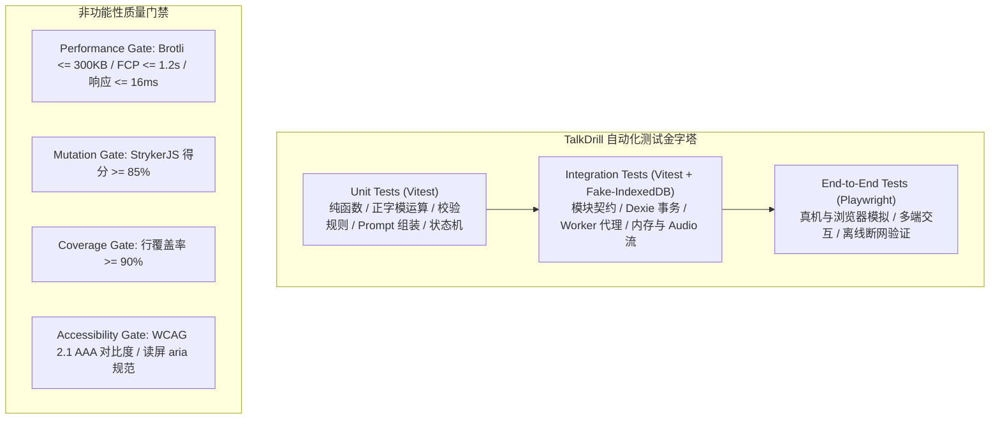

# TalkDrill - Test Strategy & Quality Assurance Framework

## 1. Executive Summary & Quality Vision

TalkDrill 是一款面向进阶外语学习者的高强度影子跟读与过度学习（Overlearning）Web 工具。鉴于其纯客户端离线优先（Offline-First）、去中心化数据自持（BYOK）以及物理级跟读交互（16ms 极速打卡响应、变调不变速音频控制、纸电双轨实践）的核心定位，系统的质量保证体系必须建立在**高确定性、可追溯性与严格自动化质量门禁**之上。

本策略依据 [docs/PRD.md](file:///Users/victorxu/projects/talkdrill/docs/PRD.md)、[docs/Architecture.md](file:///Users/victorxu/projects/talkdrill/docs/Architecture.md)、[docs/API_Spec.md](file:///Users/victorxu/projects/talkdrill/docs/API_Spec.md) 与 [docs/User-Flows.md](file:///Users/victorxu/projects/talkdrill/docs/User-Flows.md) 制定，为开发团队与 AI 编码智能体提供端到端的测试规范。

---

## 2. Test Levels & Testing Scope

系统测试划分为四大核心层级，各层级职责清晰、边界明确：

### 2.1 单元测试 (Unit Testing)
- **测试范畴**：纯函数、数学计算与无副作用业务逻辑。
- **重点覆盖模块**：
  - “正”字笔画纯函数计算（`calculateZhengStrokes(count)`，单笔 1 至 5 映射与模运算）。
  - 四级心理里程碑检测器（`checkMilestone(prev, curr)` 针对 50/150/300/500 的边界判定）。
  - 口语化 System Prompt 组装器与语言代码映射。
  - 打印 Markdown 表格生成器与纯文本解析器（<= 2MB 边界过滤）。
  - 播放倍速限制校验与 A-B 区间浮点数钳位计算。
- **质量门禁指标**：单测代码行覆盖率严格 `>= 90%`，变异测试得分（Mutation Score）严格 `>= 85%`。

### 2.2 集成测试 (Integration Testing)
- **测试范畴**：模块协作、持久化边界与网络适配层。
- **重点覆盖场景**：
  - `StorageModule` (Dexie.js / IndexedDB)：数据增删改查、级联删除（删除篇目同步清理 `audios` 与 `drillLogs`）、大尺寸二进制 `Blob` 的读取与存储完整性。
  - `PlayerEngine` 混合引擎：原生 HTML5 Audio 与 Web Audio 上下文协同、`URL.createObjectURL` 与 `URL.revokeObjectURL` 内存安全生命周期。
  - `EdgeProxy` 适配器：Anthropic Messages 格式流式中转、多厂商 TTS 二进制流转发、网络异常（401, 429, 502）重试与错误代码映射。
  - `DrillCounter` 乐观更新与防抖异步写回集成：验证高频快速敲击按键时，内存状态瞬时递增且数据库最终一致性无丢失。

### 2.3 系统与兼容性测试 (System & Compatibility Testing)
- **测试范畴**：跨端视口自适应、系统打印控制与离线 PWA 机制。
- **重点覆盖场景**：
  - 视口自适应：Desktop (>= 1024px 三栏)、Tablet (768px-1023px 抽屉)、Mobile (< 768px 单栏及 58px 超大胶囊热区)。
  - 打印媒体控制：`@media print` 样式在原生打印预览下的元素隐去、18pt 字号、2.2 行高以及 60/100 宫格防分页切断机制。
  - PWA 离线脱网：断开网络后，Service Worker 对核心静态资源拦截及 IndexedDB 读写顺畅度。

### 2.4 端到端测试 (End-to-End Testing via Playwright)
- **测试范畴**：真实多浏览器（Chromium, WebKit/Safari, Firefox）模拟下的完整用户旅程。
- **核心工具**：严格使用 **Playwright** 自动化模拟器驱动。
- **核心场景**：
  - 录入 -> 翻译 -> 音频生成/上传 -> 键盘/触控跟读打卡 -> 500 遍里程碑 -> 打印导出。
  - 移动端单手盲操与音频解锁手势链路验证。

---

## 3. Coverage Model & Risk-Based Prioritisation

依据产品核心价值与潜在系统风险，将测试特性划分四级优先级：

| 优先级 | 功能模块与特性 | 质量风险分析 | 核心验证重点 |
|---|---|---|---|
| **Critical (P0)** | 核心跟读打卡交互与正字网格渲染 | 用户敲击 Space 或触控胶囊是每篇 500 遍的最高频行为，任何延迟与丢帧将彻底摧毁体验 | 端到端更新延迟 `<= 16ms`，正字笔画无闪烁无错位，数字连续累加无遗漏 |
| **Critical (P0)** | 音频引擎与本地持久化 (Blob) | 音频播放异常或 IndexedDB 存取失败会导致跟读核心流程中断；内存泄漏会导致移动端浏览器崩溃 | 变调不变速精准度、A-B 断点无爆音、Blob 存储 `<= 100ms` 装载、URL 正确释放 |
| **High (P1)** | 移动端音频自动播放解锁 (User Gesture) | iOS Safari 与 Android 严格限制自动播放，未授权状态会导致发音受阻 | 首次用户交互触发 `AudioContext.resume()`，全端手势解锁鲁棒性 |
| **High (P1)** | 纸质排版打印 (`@media print`) | 纸笔朗读是核心双轨价值，打印错版或跨页断裂将影响线下练习 | 正文样式放大、UI 完全隐去、60/100 正字表方格整齐且 `break-inside: avoid` |
| **High (P1)** | 无状态边缘反向代理 (Cloudflare Worker) | 第三方 LLM/TTS 接口的 CORS 拦截与流式转发稳定性 | 请求头单向透传、SSE 流式打字机响应、零数据缓存合规性 |
| **Medium (P2)** | 语料录入与模式 A/B 分支流转 | 文本超限或格式解析异常影响篇目创建 | `.txt` 拖拽导入 `<= 2MB` 限制校验、模式切换状态机隔离 |
| **Medium (P2)** | 撤销与任意次数手动微调模态框 | 用户误按或从线下纸质练习回归时需要同步进度 | `Z` 快捷键撤销至 0 下限校验、数字微调模态输入区间 `[0, 99999]` |
| **Low (P3)** | 系统设置与整库 JSON 导出/抹除 | 低频管理操作，但涉及隐私合规与数据安全 | Key 密码掩码显示、JSON 导出完整性、二次输入确认原子清空数据 |

---

## 4. Automation Strategy & TDD Workflow for Coding Agents

### 4.1 测试工具链选型
- **测试运行器**：`Vitest`（极速原生 ESM 支持，完美适配 Vite 打包环境）。
- **DOM / 组件测试**：`@testing-library/react` 与 `@testing-library/user-event`。
- **IndexedDB 仿真**：`fake-indexeddb`（在 Node.js 内存环境中全真模拟 IndexedDB 与 Dexie.js）。
- **音频上下文仿真**：`web-audio-mock-api` 或轻量级 AudioContext Stub。
- **E2E 浏览器仿真**：`@playwright/test`。
- **变异测试引擎**：`@stryker-mutator/core` 与 `@stryker-mutator/vitest-runner`。
- **性能与静态度量**：Lighthouse CI、ESLint、TypeScript `tsc --noEmit`。

### 4.2 TDD (Test-Driven Development) 研发循环规范
AI 编码智能体及开发工程师必须严格执行 RED -> GREEN -> REFACTOR 循环：
1. **RED 阶段**：
   - 依据 [docs/API_Spec.md](file:///Users/victorxu/projects/talkdrill/docs/API_Spec.md) 与 [docs/Functional-Test-Cases.md](file:///Users/victorxu/projects/talkdrill/docs/Functional-Test-Cases.md)，先编写必定失败的单元测试用例。
   - 验证测试断言具备明确的拦截报错信息。
2. **GREEN 阶段**：
   - 编写满足测试的**最小可行代码**（Minimal Implementation）。
   - 保持单个函数 `<= 30 行`，圈复杂度 `<= 10`。
   - 运行测试套件，确保用例 100% 变绿通过。
3. **REFACTOR 阶段**：
   - 重构提升代码整洁度与模块化抽象，消除代码异味。
   - 运行静态检查（TypeScript、ESLint），确保零警告、零 `any`。
   - 运行变异测试，确保断言杀死率 `>= 85%`。

---

## 5. Quality Gates & Release Readiness Criteria

| 质量门禁阶段 | 准入条件 (Entry Criteria) | 准出条件 (Exit Criteria) |
|---|---|---|
| **代码提交 (Pre-Commit)** | 本地代码有改动 | TypeScript `tsc --noEmit` 零类型报错；ESLint 零告警；函数行数与复杂度达标 |
| **单元与集成测试 (PR Gate)** | 静态分析全绿 | Vitest 测试套件 100% 通过；代码行覆盖率 `>= 90%`；变异测试得分 `>= 85%` |
| **端到端测试 (E2E Gate)** | 集成测试全绿 | Playwright 在 Chromium, WebKit, Mobile Viewport 跑通全部 5 大核心用户旅程 |
| **构建与性能 (Build Gate)** | E2E 测试全绿 | Vite 构建产物经 Brotli 压缩核心包体积 `<= 300KB`；Lighthouse 性能分 `>= 95` |
| **发布就绪 (Release Ready)** | 构建预算达标 | 脱网离线可用性核验通过；纸质打印 `@media print` 跨浏览器渲染验收通过 |

---

## 6. Mandatory Upstream Issue Logging (跨域设计核验日志)

在对 PRD、架构、API 与 UI/UX 设计文档进行全量交叉核验时，发现并明确记录以下两项关键设计细节，已在本次测试规范中予以闭环：

- **ISSUE-01 [Severity: MEDIUM] [Resolved] - 离线环境下 TTS 调用的容错与空音频处理**：
  - *现象描述*：在断网环境下，若用户尝试录入新语料并点击“在线 TTS 合成”，上游文档未明确界面是直接阻断流程还是允许以无音频方式继续练习。
  - *核验解决*：在 [docs/Functional-Test-Cases.md](file:///Users/victorxu/projects/talkdrill/docs/Functional-Test-Cases.md) 中增加显式用例 `TC-FT-AUD-005`，规定当 TTS 离线失败时，界面弹出“网络离线无法合成”并提供“以纯文本朗读模式保存”的分支，保障用户不被卡死。
- **ISSUE-02 [Severity: LOW] [Resolved] - 移除移动端虚拟按键震动与声音反馈**：
  - *现象描述*：产品明确无需物理震动与机械咔哒音效反馈，要求实现最纯粹无干扰的视觉打卡体验。
  - *核验解决*：在 [docs/Functional-Test-Cases.md](file:///Users/victorxu/projects/talkdrill/docs/Functional-Test-Cases.md) 规定打卡采用纯视觉响应（胶囊微缩放与正字实时渲染），彻底移除震动 API 与 Web Audio 机械声效，避免多平台兼容性与音频打扰。
