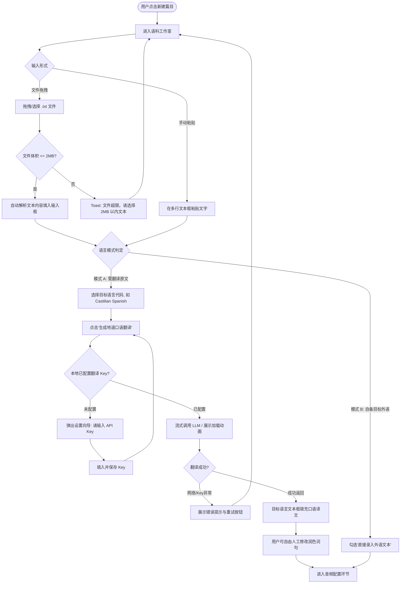
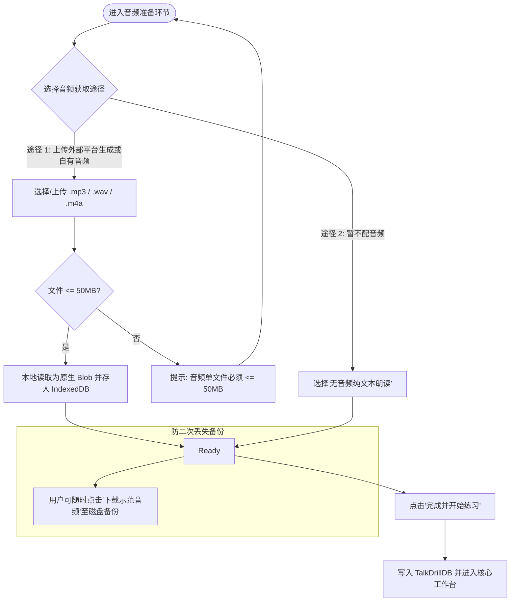
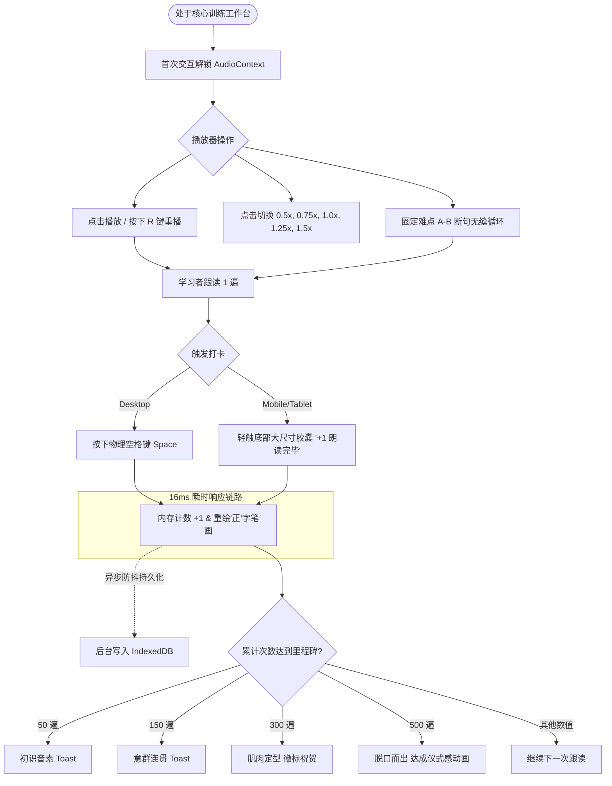
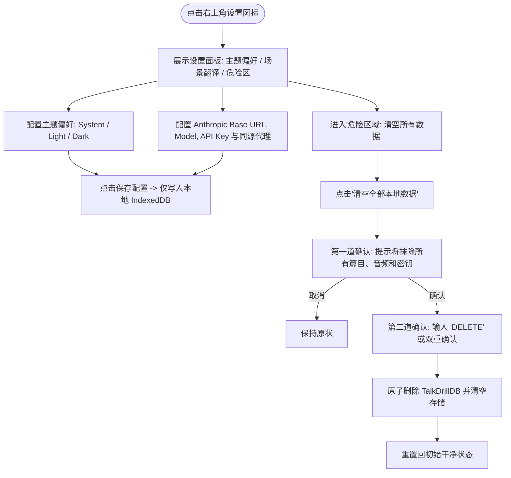

# TalkDrill - User Flows & Navigation Specification

## 1. Overview

本文档根据 [docs/PRD.md](file:///Users/victorxu/projects/talkdrill/docs/PRD.md) 规定 TalkDrill 产品的核心用户体验动线、交互流转逻辑与导航架构。

### 1.1 产品核心目标 (Product Goals)
- **零认知负担跟读**：让进阶外语学习者在极低摩擦的环境下执行 300 至 500 遍影子复诵（Shadowing），打通声音到发音肌肉的直觉反射。
- **全场景双轨实践**：支持屏幕端毫秒级盲操打卡与纸质实体无干扰大字排版（含 60/100 格“正”字打卡表）自由切换。
- **去中心化自主控制**：支持自备模型密钥（BYOK），所有文本、音频与打卡记录本地自持。
- **全英文沉浸交互界面 (English UI)**：全站用户操作界面、按钮、提示及无障碍文案严格采用全英文，打造沉浸式外语环境。

### 1.2 主要用户类型 (Primary User Types)
- **Elena (深度研读型用户)**：以桌面端录入口语素材、配置 Castilian Spanish 地道翻译、合成音频并打印纸质材料带走朗读为主。
- **Kenji (通勤碎片型用户)**：以移动端单手盲操打卡、A-B 断句高频单曲循环、利用碎片时间完成 500 遍突破为主。

### 1.3 应用核心入口 (Entry Points)
- **Web 端直接访问**：浏览器打开首页，默认载入上一次最后练习的篇目（若有）或篇目库列表。
- **PWA 独立窗口启动**：支持从桌面或移动端主屏幕以 Standalone 模式启动，提供脱网离线体验。

---

## 2. Global Navigation & Architecture

```mermaid
graph TD
    AppRoot[TalkDrill 统一应用壳]
    
    AppRoot --> Screen1[Screen 1: 篇目库管理 Overview]
    AppRoot --> Screen2[Screen 2: 语料录入与翻译工作室 Studio]
    AppRoot --> Screen3[Screen 3: 跟读强化训练工作台 Workspace (核心)]
    AppRoot --> Screen4[Screen 4: 纸质排版打印与导出面板 Print Modal]
    AppRoot --> Screen5[Screen 5: 系统设置与服务配置中心 Settings]

    Screen1 -->|点击新建篇目| Screen2
    Screen1 -->|点击已有篇目卡片| Screen3
    Screen1 -->|点击卡片编辑按钮| Screen2
    Screen1 -->|点击卡片归档或恢复| Screen1
    
    Screen2 -->|完成录入/翻译/音频并保存| Screen3
    Screen2 -->|取消新建或编辑| Screen1
    
    Screen3 -->|返回篇目库| Screen1
    Screen3 -->|点击编辑当前篇目| Screen2
    Screen3 -->|切换归档或恢复| Screen3
    Screen3 -->|点击打印或导出| Screen4
    Screen3 -->|点击设置图标| Screen5
    
    Screen4 -->|触发系统打印或导出后关闭| Screen3
    Screen5 -->|保存或清空数据后关闭| Screen3
```

---

## 3. Core User Journeys & Workflows

### 3.1 语料录入与口语化翻译工作流 (Workflow 1: Corpus Onboarding & Translation)



- **用户目标**：快速导入真实语料，对于英文原文一键获取本土母语级口语表达并可手动校订。
- **触发点**：顶部导航栏“+ 新建篇目”按钮。
- **分支逻辑**：
  - 模式 A（需翻译）：必须选择目标语言后发起 AI 翻译，完成后文本框保持可编辑。
  - 模式 B（自备目标语言）：直接输入，跳过任何 LLM 调用，降低摩擦。
- **异常恢复**：若未配置 API Key，就地弹出简易凭据配置抽屉，保存后自动继续，无页面刷新。

---

### 3.2 音频获取与管理工作流 (Workflow 2: Audio Setup & Management)



- **用户目标**：为语料绑定母语级原声或自有录音，并持久化到本地。
- **核心体验**：支持用户借助第三方平台根据文本生成音频后上传，并提供音频下载备份保护。

---

### 3.3 核心影子跟读与低阻力打卡工作流 (Workflow 3: Core Shadow Drill Loop)



- **用户目标**：跟读一句，打卡一次；在最少肢体与视觉干扰下，完成数百次肌肉记忆循环。
- **关键设计**：
  - Space 物理键全局响应（只要焦点不在可编辑输入框内）。
  - 移动端底部 `>= 56px` 的巨型胶囊按钮，支持拇指盲按。
  - 笔画与数字更新必须在当前帧（`<= 16ms`）完成渲染。

---

### 3.4 计数撤销与手动修正工作流 (Workflow 4: Undo & Manual Override)

```mermaid
flowchart TD
    Mistake([用户误触打卡或需要校正]) --> FixType{选择修正方式}
    
    FixType -->|极速单次撤销| UndoAction[Desktop 按下 Z 键 或 点击撤销小按钮]
    UndoAction --> CheckZero{当前计数 > 0?}
    CheckZero -->|否| DoNothing[保持 0 并不报错]
    CheckZero -->|是| DecrCount[计数 -1 & 擦除'正'字对应最后一笔] --> FlashUndo[视觉即时微弱反馈]
    
    FixType -->|大跨度数字修正| ClickNumber[点击阿拉伯数字如 '128 / 500']
    ClickNumber --> OpenModal[弹出数字微调弹窗 (带数字键盘)]
    OpenModal --> InputVal[输入目标完成次数 (0 - 99999)]
    InputVal --> ConfirmVal[点击确定]
    ConfirmVal --> ValidateNum{数值有效?}
    ValidateNum -->|格式错误/负数| ShowErr[红字提示: 请输入非负整数] --> InputVal
    ValidateNum -->|合法| CommitVal[瞬间更新总计数并重绘对应正字阵列] --> CloseModal[关闭弹窗]
```

- **用户目标**：纠正误触或从纸质打印脱网练习后把完成次数同步回电子端。

---

### 3.5 纸质排版打印与导出工作流 (Workflow 5: Print & Export)

```mermaid
flowchart TD
    DrillView([在工作台阅读篇目]) --> ClickPrint[点击顶部'打印 / 导出'按钮]
    ClickPrint --> OpenPrintSheet[弹出打印与导出配置面板]
    
    OpenPrintSheet --> Choice{选择操作类型}
    
    Choice -->|纸质物理打印| SelBoxes[选择打卡方格数量: 60格/300遍 或 100格/500遍]
    SelBoxes --> CallSysPrint[点击'发起打印']
    CallSysPrint --> CSSMediaPrint[触发浏览器原生打印窗口: @media print]
    CSSMediaPrint --> CleanLayout[自动隐藏所有 UI 控件, 字号 18pt, 行高 2.2, 页末输出网格]
    
    Choice -->|导出 Markdown| ClickMD[点击'下载 .md 模板']
    ClickMD --> SaveMDFile[生成包含段落与标准方格表格的 .md 文件]
    
    Choice -->|复制富文本| ClickRich[点击'复制富文本']
    ClickRich --> CopyClip[写入系统剪贴板 (带样式表格)]
    CopyClip --> PasteWord[用户可直接在 Word / Google Docs 粘贴使用]
```

---

### 3.6 系统设置与凭据自持工作流 (Workflow 6: Settings & Data Purge)



---

## 4. Screen Transitions & Deep Linking Rules

### 4.1 屏幕过渡规范
- **单页平滑切换**：所有视图切换均在 SPA 内部完成，不触发完整浏览器重载。
- **抽屉与弹窗动画**：
  - 移动端篇目库与设置采用吸底抽屉（Bottom Sheet），划动手势或点击遮罩关闭。
  - 桌面端设置与数字微调采用居中轻量模态框（Modal with backdrop blur）。
  - 转场过渡时长限制在 `150ms - 200ms`（`cubic-bezier(0.16, 1, 0.3, 1)`），严禁冗长拖沓的复杂动效，保证打卡工具的利落感。

### 4.2 路由与状态恢复 (URL Hash Navigation)
- `#/`：主工作台（默认加载最后一次活跃篇目；若库为空则展示快速创建引导）。
- `#/library`：篇目库概览列表（支持 Active 与 Archived 独立视图切换，卡片提供 Edit、Archive/Restore 与 Delete 按钮）。
- `#/studio`：新建篇目工作室。
- `#/studio?edit=:articleId`：编辑已有篇目工作室（预填内容与音频，保存保留累积打卡遍数）。
- `#/drill?id=:articleId`：指定篇目的跟读强化工作台（顶部提供 Edit 与 Archive/Restore 入口）。
- `#/settings`：打开设置模态。
